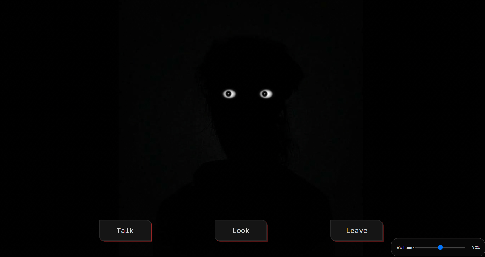

# Are you there ?
> A samm interactive horror website where u will talk to a creepy guyy ig idk about his gender hehe . 

The main idea of this website is quite simple when you open the website u will see  a face without face TwT only eyes staring att you . the eyes will follow your mouse movement which will make u fear his gazeeeeeee hehe.
you will see three button 

- Talk
- look
- leave
you can talk and interact with it , but the longer you talk the starnger it will answer.

you can look at his eyes as by clicking look
When you click leave it will be kinda sad .. (and yea u need to click leave button to make the smile appear next time you come back )
But when you come back it will great you and remmber you
so do check out by leaving and coming backk

## Feature 
> hmm there isn't so much feature but here they are 
- Interactive dialogue
- Eye that will follow you mouse
- other humm.. local storage  , background sound, clicking sound.

## Tech Stack

- JavaScript
- css
- HTML 5

## how does the memory work ?
the website uses the browser's inbuilt localstorage to remmber your session and how many time you've interacted with the character
for example:
```text
First visit
    ↓
Interact with the character
    ↓
Leave
    ↓
Come back
    ↓
The website remembers you